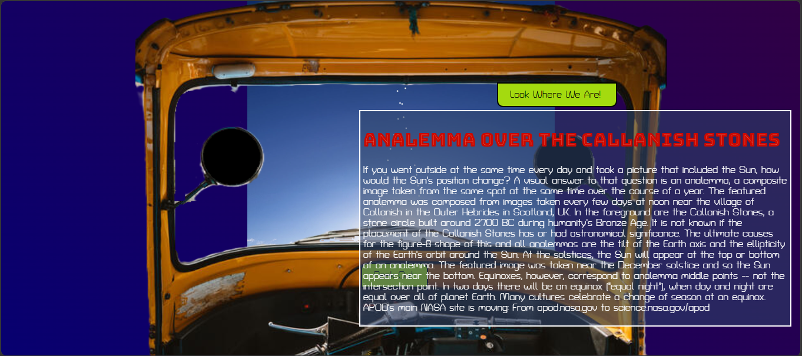

# Rocket Rikshaw
An India inspired NASA APOD Viewer that makes you feel like youre on a ROCKET RIKSHAW!

## Try it here:
https://spicethecode.github.io/rocketRikshaw/

## Features:
1. View the nasa Astronomy Picture Of The Day from a beautiful view finder :)
2. Peek Out if you can't see well enough from the auto
3. Read about the view from the inbuilt auto viewfinder!

## API Used
This project uses the free NASA API that provides us with an Astronomy Picture Of The Day.

The codebase asks the api for data and extracts the title, explaination and the APOD itself.

Considering that the APOD could be an image, a video or a youtube link, our website is capable of handling any three of the formats offered by NASA.

## Design Choices:
The background of the website is a blue-violet gradient, built to replicate a cosmos-like view.

The font used for headers (Bungee Tint) and the text (Turret Road) are meant to look futurisitic and the explatination box is designed to look like a Heads-Up-Display or a hologram.

## Credits and Acknowledgements
Photos from Unsplash, Freepik and Google Photos.

Fonts from Google Fonts.

Greatful for the support from friends and family.

And most importantly HackClub and Stardance for the unique opportunity!